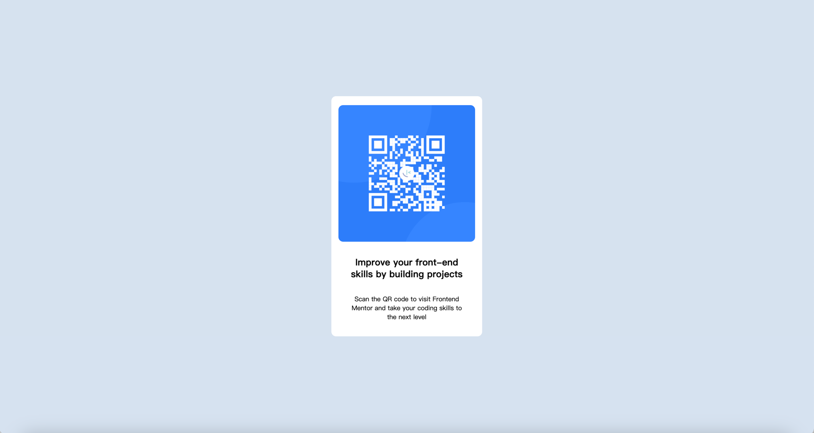

# Frontend Mentor - QR code component solution

This is a solution to the [QR code component challenge on Frontend Mentor](https://www.frontendmentor.io/challenges/qr-code-component-iux_sIO_H). Frontend Mentor challenges help you improve your coding skills by building realistic projects. 

## Table of contents

- [Overview](#overview)
  - [Screenshot](#screenshot)
  - [Links](#links)
- [My process](#my-process)
  - [Built with](#built-with)
  - [What I learned](#what-i-learned)
  - [Continued development](#continued-development)
  - [Useful resources](#useful-resources)
- [Author](#author)
- [Acknowledgments](#acknowledgments)

## Overview

### Screenshot



### Links

- Solution URL: [Frontend Mentor Solution](https://github.com/yxlaisj/QR-code-component)
- Live Site URL: [Live site at github page](https://yxlaisj.github.io/QR-code-component/)

## My process

### Built with

- Semantic HTML5 markup
- CSS custom properties
- Flexbox


### What I learned

Learn basic use of html and css.
You should start by thinking about the structure of your web page. 

```html
<div class="content">
  <div class="card">
    
    
  </div>
  <h1>Improve your front-end skills by building projects</h1>
  <p>Scan the QR code to visit Frontend Mentor and take your coding skills to the next level</p>
</div>
```
```css
.content{
  margin: auto;
  width: 320px;
  height: 510px;
  background: hsl(0, 0%, 100%);
  display: flex;
  flex-direction: column;
  align-items: center;
  border-radius: 10px;
}
```

### Continued development

**How to determine the size of an element when designing a page.**

### Useful resources

- [w3schools](https://www.w3schools.com/css/default.asp) - As a front-end beginner, this site has helped me learn a lot about CSS usage.

## Author

- Github - [yxlaisj](https://github.com/yxlaisj)
- Frontend Mentor - [@yxlaisj](https://www.frontendmentor.io/profile/yxlaisj)
